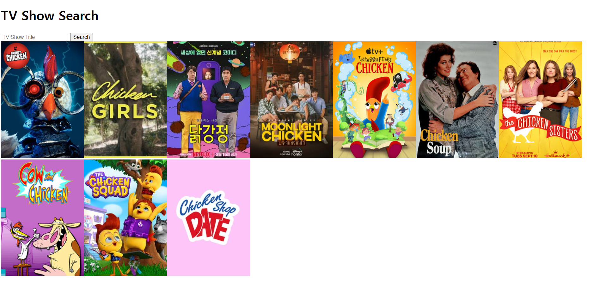

# TV 프로그램 검색 프로젝트 (학습용 프로젝트)

;

### 배운점

- fetch를 이용한 데이터 fetching을 학습하였다
- async, await 를 이용한 비동기 작업에 대해 학습하였다
- axios를 활용하여 fetch와 비교했을 때, 보다 코드를 간소화시킬 수 있었다.

### 활용 API

- https://www.tvmaze.com/api
- https://swapi.dev/
